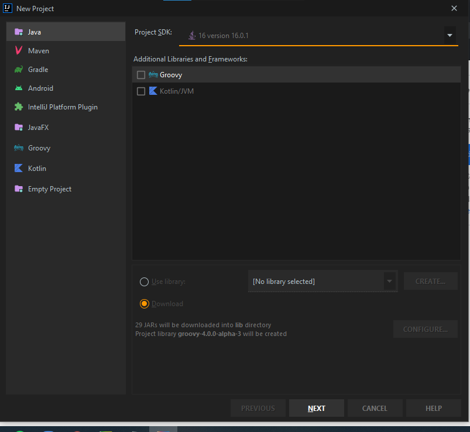
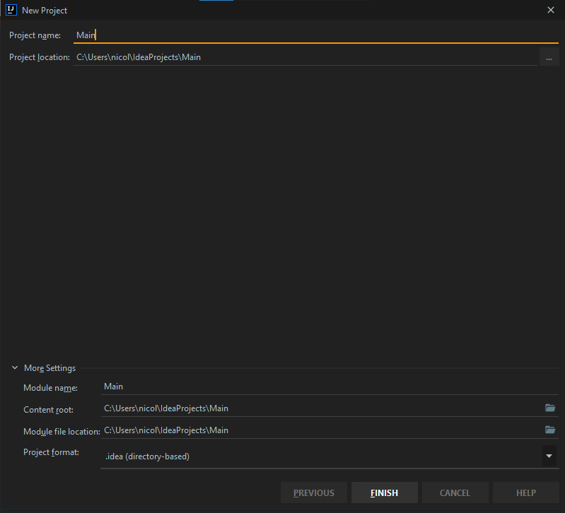
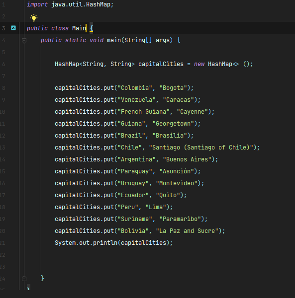
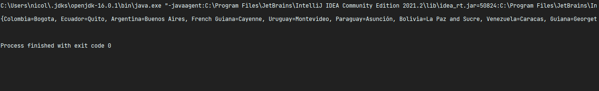

# How to create a hashmap in java
### By Nicolas Gomez R

So, to do a very simple hashmap in java first you need open your editor, in
my case intellij idea and then create a new project called Main, first in 
Intellij Idea it will say you to select the jdk (Java Development Kit):

 

You'll select your jdk, and then you'll name your project:

Then you'll need to wait to intellij idea charge all the main things and 
when it ends you'll right-click the folder with the name of your project and 
click New File, and name the file Main.java then you'll import the java.util.HashMap 
package (HashMap Class):

`import java.util.HashMap`

So, you'll need also to declare a class of the same name of the file (Main):

`public class Main:`

and declare a `public static void main(String[] args)`, then declare a hashmap variable called capitalCities:

`HashMap <String, String> capitalCities = new HashMap<>();`

finally you'll add the capitalCities with capitalCities.put("null", "null") method, example:

`capitalCities.put("Country", "Capital Cities")`

and repeat it four times, when you finish you'll write the last line

`System.out.println(capitalCities)`

When you finish you'll program will look like this:

Finally, you'll execute your code and the answer will look like this

